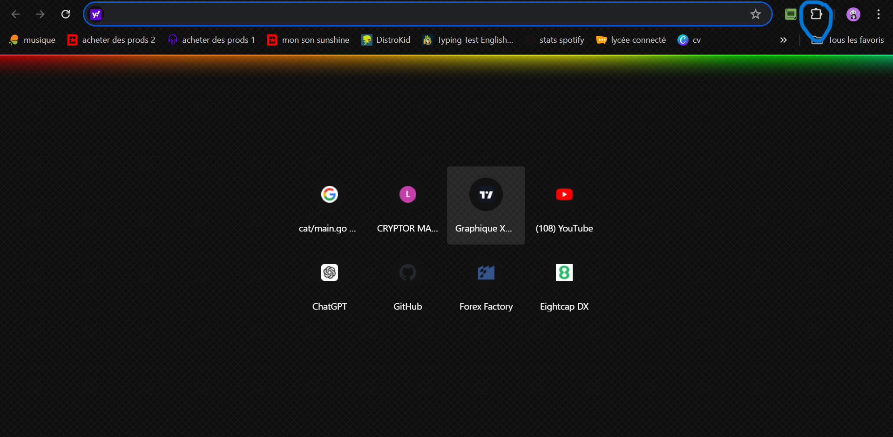
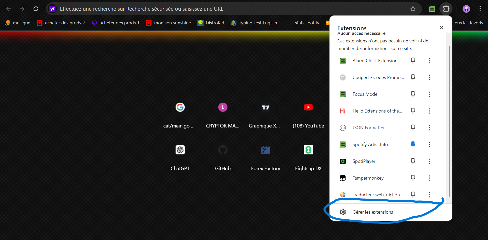
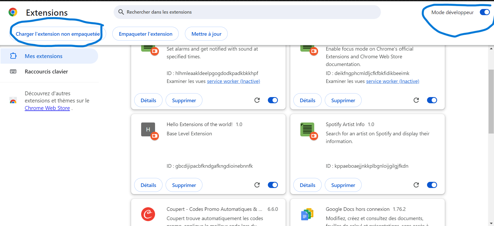
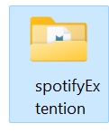
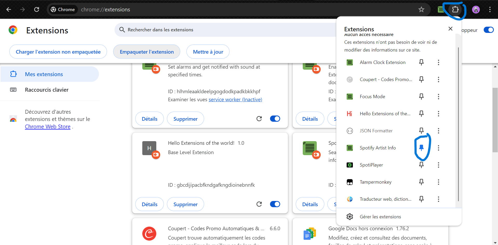
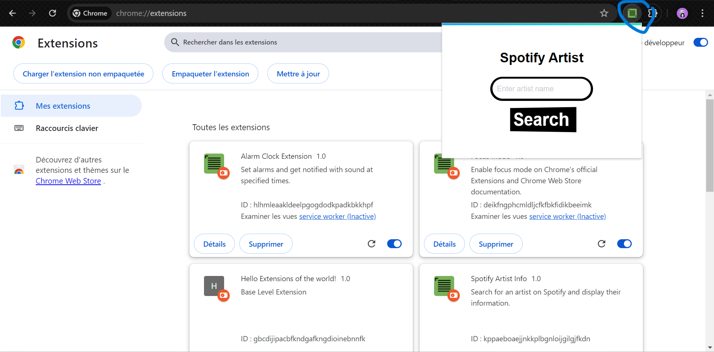
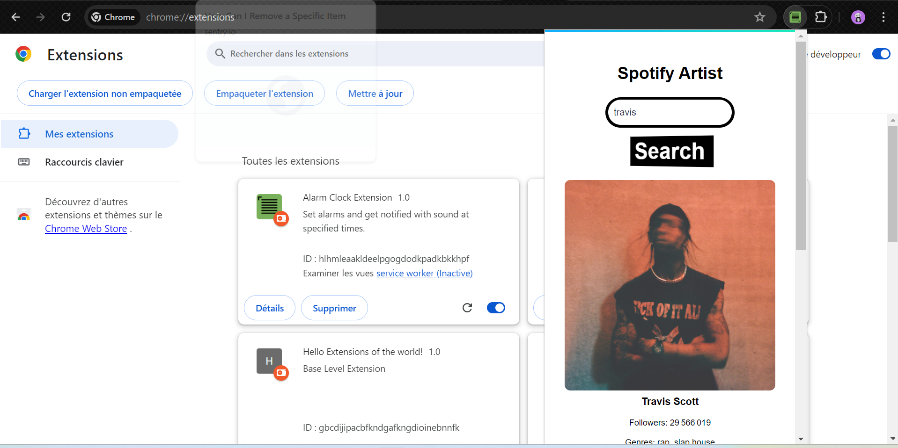

# SPOTIFY EXTENSION

Ce projet est une extension chrome basé sur l'api de spotify.

## Fonctionnalités

- Interface graphique conviviale pour une expérience utilisateur agréable.
- Barre de recherche permettant d'avoir accès a plein d'informations sur les artistes disponible sur spotify : *
    - Photo de l'artiste
    - Nom d'artiste
    - Followers
    - Genres musicales
    - Tous les albums disponibles
    - Et les 10 musiques du moment de cet artiste

## Prérequis

- Une connaissance de base en programmation en JavaScript.
- Google Chrome

## Comment utiliser notre extension :

1. Clonez ce dépôt sur votre machine(terminal) avec la commande ci-dessous :

```
git clone https://github.com/danyGhassan/spotifyExtention.git
```

2. Ensuite ouvrez votre navigateur Google Chrome et appuiyez a l'endroit comme ci dessous et suivez ensuite le tuto : 

Appuyez sur "gérer les extensions" : 

Appuyez sur "mode developpeur" ensuite sur "changer l'extension non empaquetée"

Ouvrez le dossier qui a été installé avec la commande 'git clone' : 

Ensuite épingler l'extension

Puis appyez sur l'icone qui apparait a coté des extensions

Maintenant profitez


## Contributeurs

- [Dany Ghassan]- [Matis Celestin] - Développeur 